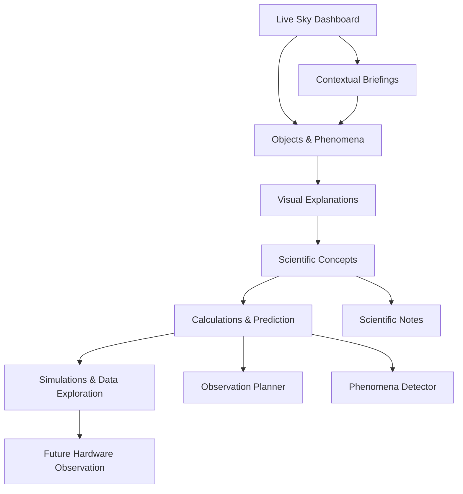
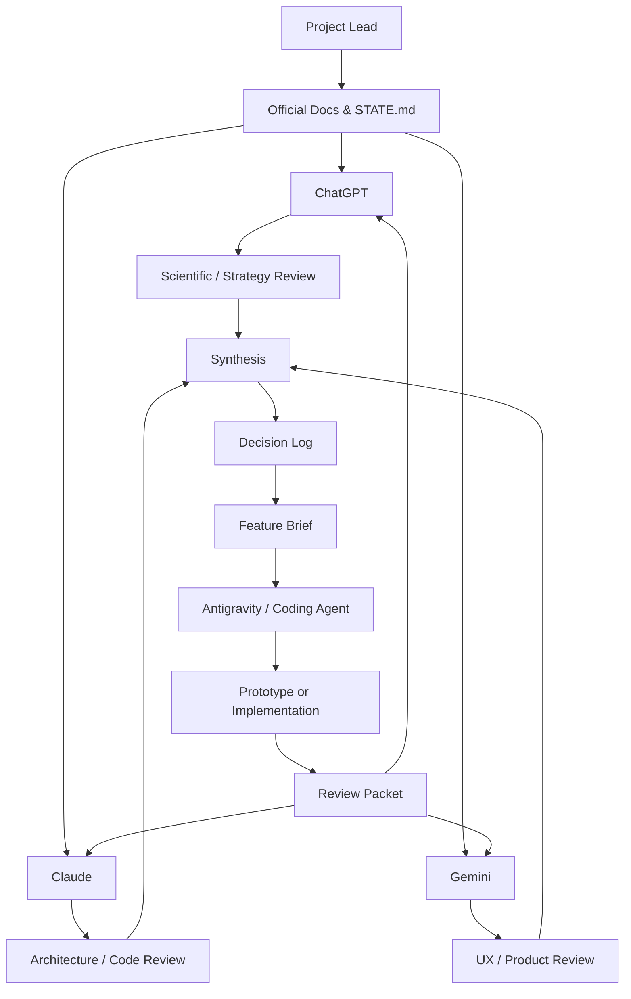
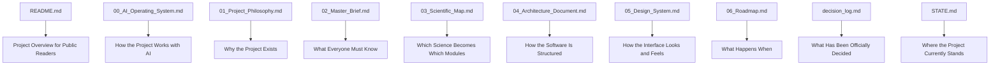

# AstroPhenomena Explorer — Master Brief v0.1

**Version:** v0.1
**Status:** First operational master brief
**Language:** English-first, bilingual-ready later
**Document role:** Give any AI tool, developer, reviewer or GitHub reader a clear operational understanding of AstroPhenomena Explorer.

---

## 1. Purpose of This Document

This document is the operational entry point for understanding and working on **AstroPhenomena Explorer**.

It summarizes the project identity, current state, validated principles, working rules, AI roles, scientific direction, product direction and immediate next steps.

It is designed for:

* ChatGPT;
* Claude;
* Gemini;
* Antigravity or other coding agents;
* future human readers discovering the GitHub repository;
* the project lead, as a compact reference document.

This Master Brief is not meant to replace the detailed source documents.

It provides a clear working overview so that any contributor or AI assistant can quickly understand:

* what the project is;
* what it is not;
* how decisions are made;
* what must be respected;
* what should be built next;
* how to avoid generic, unstable or scientifically weak outputs.

---

## 2. Project Identity

### Project name

**AstroPhenomena Explorer**

### Subtitle

**Understanding, Visualizing and Predicting Astronomical Phenomena**

### Core identity

AstroPhenomena Explorer is a long-term open-source astronomy platform designed to make the sky feel:

* alive;
* personal;
* understandable;
* observable;
* predictable;
* scientifically explorable.

The project connects:

* astronomy;
* celestial mechanics;
* scientific programming;
* data visualization;
* visual learning;
* observation planning;
* astronomical phenomena;
* future hardware-assisted observation.

The project is developed as a personal engineering, scientific and educational journey.

It is public on GitHub, but personally directed.

### Central promise

> **Transform the sky from something passively observed into a living system that can be explored, understood, predicted and scientifically analyzed.**

---

## 3. One-Minute Summary

AstroPhenomena Explorer is an open-source platform for exploring the sky through live context, scientific explanation, visual intuition and progressive prediction.

The first intended user experience is a **Live Sky Dashboard**: a location-aware and time-aware interface showing what is happening in the user’s sky, what is visible, what is changing, and what deserves attention.

The platform should not behave like a static astronomy encyclopedia.

It should start from visible objects and phenomena, then guide users toward the underlying scientific concepts:

```text
Visible object or phenomenon
        ↓
User curiosity
        ↓
Visual explanation
        ↓
Scientific concept
        ↓
Calculation / prediction / data
        ↓
Deeper exploration
```

The project must remain scientifically grounded.

It should rely first on deterministic calculations, open data, curated explanations and transparent reasoning — not paid AI APIs or black-box generation.

The long-term goal is to build a coherent platform that helps users understand, visualize, predict and eventually observe real astronomical phenomena.

---

## 4. Current Project State

The project is currently in the **conceptual consolidation and foundation phase**.

This means that the priority is not yet to build the full application.

The priority is to define the rules, philosophy, scientific map, architecture and development sequence before asking coding agents to implement major features.

### Current validated documents

The following documents are considered validated enough to guide the next steps:

| Document                    | Status | Role                                                                   |
| --------------------------- | ------ | ---------------------------------------------------------------------- |
| `00_AI_Operating_System.md` | v0.2   | Defines how the project works with AI tools                            |
| `01_Project_Philosophy.md`  | v0.2   | Defines the identity, vision, principles and boundaries of the project |

### Current document

| Document             | Status | Role                                                 |
| -------------------- | ------ | ---------------------------------------------------- |
| `02_Master_Brief.md` | v0.1   | Operational overview for AI tools and GitHub readers |

### Next documents to create

| Document                      | Purpose                                                                  |
| ----------------------------- | ------------------------------------------------------------------------ |
| `03_Scientific_Map.md`        | Map scientific concepts from DU ECU and astronomy into modules           |
| `04_Architecture_Document.md` | Define software architecture and module boundaries                       |
| `05_Design_System.md`         | Define visual identity, UI rules, layout, cards and interaction patterns |
| `06_Roadmap.md`               | Define development phases, milestones and first build targets            |

### Current practical rule

Coding can begin in prototypes before all documentation is perfect, but serious implementation must wait for:

* a validated Master Brief;
* a first Scientific Map;
* a first Architecture Document;
* a Roadmap;
* a precise Feature Brief.

---

## 5. Validated Source Documents

The Master Brief summarizes two validated source documents.

If a conflict exists, the more specific source document takes priority.

### 5.1 AI Operating System

`00_AI_Operating_System.md`

This document defines how the project works with AI.

It covers:

* source of truth;
* role of the project lead;
* role of ChatGPT, Claude, Gemini and Antigravity;
* decision log;
* `STATE.md`;
* work tiering;
* sketch / experimental / stable distinction;
* spike allowance;
* design-to-code definition of done;
* review workflow;
* challenge protocol.

Its core purpose is:

> **Define how the project is governed and how AI tools should work together.**

### 5.2 Project Philosophy

`01_Project_Philosophy.md`

This document defines the soul and identity of AstroPhenomena Explorer.

It covers:

* Live Sky Dashboard first;
* objects and phenomena as entry points;
* visual intuition before formalism;
* mission briefing voice;
* self-sufficient intelligence;
* scientific traceability;
* public but personally directed open-source approach;
* digital-first, hardware later;
* what the project refuses to be.

Its core purpose is:

> **Define why the project exists and what kind of experience it must become.**

### 5.3 Master Brief

`02_Master_Brief.md`

This document summarizes the project operationally.

Its core purpose is:

> **Give any AI or human reviewer enough context to work correctly without re-reading every previous discussion.**

---

## 6. Core Product Direction

AstroPhenomena Explorer should become a live, contextual and exploratory astronomy platform.

The user should first encounter the sky through a **Live Sky Dashboard**.

This dashboard is the intended first product experience, but not necessarily the first complete system to build.

The dashboard will be assembled progressively as scientific engines become available.


### 6.1 Product logic

The platform should move from:

```text
What is happening in my sky?
        ↓
What can I observe?
        ↓
Why does it happen?
        ↓
How is it calculated?
        ↓
What else can I explore?
```

The product should begin with the visible and move toward the scientific.

### 6.2 Primary entry points

The platform should prioritize:

* celestial objects;
* astronomical phenomena;
* observation opportunities;
* visible changes;
* time-dependent events;
* local sky context.

The user should not begin with abstract lessons.

They should begin with something they can see, observe, recognize or become curious about.

### 6.3 Project System Map

The following diagram summarizes the intended system logic.




### 6.4 Dashboard rule

The dashboard must not display everything at once.

It must prioritize information based on:

* user location;
* current time;
* visibility;
* rarity;
* scientific relevance;
* observation opportunity;
* educational value.

A dashboard card belongs on the screen only if it helps the user:

* observe;
* understand;
* predict;
* compare;
* explore;
* analyze.

---

## 7. Scientific Foundation

AstroPhenomena Explorer is grounded in real astronomy concepts studied through the DU ECU and related scientific resources.

The first scientific foundation is observational astronomy and sky coordinates.

### 7.1 Initial scientific focus

The first major scientific focus is:

> **Given an object, a time and an observing location, determine where it appears in the sky and whether it is observable.**

This requires understanding:

* right ascension;
* declination;
* local sidereal time;
* hour angle;
* altitude;
* azimuth;
* culmination;
* rise and set;
* visibility conditions.

This is the foundation for the later modules:

* observation planning;
* phenomena prediction;
* sky visualization;
* occultations;
* eclipses;
* meteor observation;
* real data analysis.

### 7.2 Scientific progression

The project should grow progressively from:

```text
Sky coordinates
        ↓
Visibility
        ↓
Observation planning
        ↓
Phenomena detection
        ↓
Simulation
        ↓
Real data analysis
        ↓
Hardware-assisted observation
```

### 7.3 Scientific traceability

Every explanation, calculation or visualization should be traceable to at least one of:

* a DU ECU course concept;
* a reliable astronomy reference;
* an implemented calculation;
* an open dataset;
* a documented approximation;
* a validated scientific library;
* a clearly marked prototype placeholder.

The platform must distinguish between:

| Content type           | Meaning                                              |
| ---------------------- | ---------------------------------------------------- |
| Verified calculation   | Computed through known formulas or trusted libraries |
| Simplified explanation | Pedagogical simplification of a real concept         |
| Visual approximation   | Useful visual model, not exact simulation            |
| Prototype placeholder  | Temporary content used during exploration            |
| Future extension       | Idea not yet implemented                             |

Scientific correctness is not optional.

If the platform explains something, it should be possible to identify where the explanation comes from.

---

## 8. Working Rules

AstroPhenomena Explorer is governed by a strict documentation and decision workflow.

### 8.1 Source of truth

The GitHub repository is the source of truth.

AI conversations are not official until their outcomes are synthesized and committed into the repository.

### 8.2 Required project control files

The project should maintain:

| File                | Role                                    |
| ------------------- | --------------------------------------- |
| `STATE.md`          | Current state of the project            |
| `decision_log.md`   | Validated decisions and rationale       |
| `open_questions.md` | Pending questions and unresolved issues |
| `README.md`         | Public-facing introduction              |
| `docs/`             | Stable documentation                    |
| `ai_reviews/`       | AI review outputs                       |
| `prototypes/`       | Experimental implementations            |
| `notebooks/`        | Scientific explorations and sketches    |
| `src/`              | Stable implementation code              |

### 8.3 Decision rule

A decision becomes official only when it is:

1. clearly stated;
2. accepted by the project lead;
3. written into the appropriate document;
4. recorded in the decision log if it affects scope, architecture, UX, scientific assumptions or roadmap.

### 8.4 Scope expansion rule

Every major new idea must pass the AstroPhenomena inclusion filter:

> **Can this topic become an interactive, visual, explanatory or analytical experience?**

If yes, it may belong to the project.

If not, it should stay outside for now.

---

## 9. AI Roles and Workflow

AstroPhenomena Explorer uses multiple AI tools asynchronously.

They do not need to work in the same chat.

They need to work from the same source documents and review packets.

### 9.1 Role of the project lead

The human project lead keeps authority over:

* vision;
* priorities;
* scope;
* final decisions;
* official repository content;
* what becomes stable.

AI tools can propose, critique, implement or synthesize.

They do not own the direction of the project.

### 9.2 Role of ChatGPT

ChatGPT acts as:

* scientific and pedagogical strategy partner;
* project synthesis assistant;
* DU ECU concept translator;
* documentation builder;
* multi-AI feedback synthesizer;
* coherence guardian between science, product and architecture.

ChatGPT should help maintain the connection between:

* astronomy concepts;
* educational logic;
* project philosophy;
* software modules;
* user understanding.

### 9.3 Role of Claude

Claude acts as:

* software architecture reviewer;
* clean code advisor;
* maintainability critic;
* scope control reviewer;
* implementation risk detector.

Claude should challenge:

* unclear architecture;
* unstable module boundaries;
* over-engineering;
* premature implementation;
* technical debt;
* contradiction between vision and software structure.

### 9.4 Role of Gemini

Gemini acts as:

* product design reviewer;
* UX strategist;
* visual experience advisor;
* onboarding and dashboard critic;
* brand and interface coherence reviewer.

Gemini should challenge:

* generic visual direction;
* unclear homepage hierarchy;
* fake mission-control aesthetics;
* card overload;
* poor visual storytelling;
* weak emotional impact;
* confusing user flows.

### 9.5 Role of Antigravity or coding agents

Antigravity acts as an implementation tool.

It should:

* implement scoped tasks;
* follow feature briefs;
* respect repository structure;
* keep prototypes separate from stable code;
* report assumptions and limitations;
* avoid inventing project vision or architecture.

Antigravity should not be asked to “build the entire platform” without a precise scope.

It must receive:

* relevant documents;
* current state;
* feature brief;
* target folder;
* constraints;
* expected output;
* review criteria.

### 9.6 AI Workflow Diagram



---


## 10. Coding and Prototype Rules

Coding is allowed, but it must be controlled.

The project should avoid the trap of asking an AI agent to create a complete platform before the scientific and architectural foundations are clear.

### 10.1 Work tiers

All work should be classified as:

| Tier         | Location                           | Meaning                                    |
| ------------ | ---------------------------------- | ------------------------------------------ |
| Sketch       | `notebooks/` or quick notes        | Exploration, not production                |
| Prototype    | `prototypes/`                      | Test of an idea, UI, calculation or module |
| Experimental | marked experimental package/module | More structured, still unstable            |
| Stable       | `src/astrophenomena/`              | Official implementation                    |

### 10.2 Prototype rule

Prototypes may be visually ambitious or technically experimental.

But they must be clearly marked as prototypes.

A prototype is allowed to:

* use fake data if clearly labelled;
* test layouts;
* test visual cards;
* test calculations;
* test APIs;
* test scientific workflows.

A prototype must not:

* silently become production architecture;
* hide assumptions;
* mix fake and real data without labels;
* overwrite stable modules;
* define the project vision by accident.

### 10.3 Stable code rule

Stable code requires:

* clear module purpose;
* scientific traceability;
* tests or validation path;
* documentation;
* defined inputs and outputs;
* no unexplained magic behavior;
* alignment with the Architecture Document.

### 10.4 First serious coding target

The likely first serious implementation should be one of:

* `Sky Coordinates Explorer`;
* `Live Sky Dashboard prototype`;
* `Visibility Engine`;
* `Observation Planner foundation`.

The exact first target must be defined later in the Roadmap and Feature Brief.

---

## 11. Visual Understanding Requirements

AstroPhenomena Explorer must not become a text-heavy astronomy website.

Visual understanding is a core requirement.

Whenever a concept is complex, the project should consider whether one of the following would improve understanding:

* diagram;
* sky map;
* timeline;
* animated geometry;
* orbit representation;
* comparison view;
* altitude/azimuth plot;
* phase diagram;
* visibility window;
* interactive slider;
* real astronomical image;
* annotated visual explanation.
  


### 11.1 Rule for visuals

A visual should be added only if it helps the user understand something.

Visuals should clarify, not decorate.

### 11.2 Visual priority

The project should prefer visuals that explain:

* spatial relationships;
* motion over time;
* visibility;
* geometry;
* cause and effect;
* before/after states;
* observation context;
* data patterns.

### 11.3 Visual markers in documents

When a future visual is useful but not yet created, documents may include markers such as:

```text
[DIAGRAM NEEDED — Explain altitude/azimuth transformation]

[VISUAL NEEDED — Show Moon phase geometry]

[ANIMATION IDEA — Sun-Earth-Moon alignment over one lunar month]

[DATA VISUALIZATION NEEDED — Object altitude over tonight]
```

These markers should help future design and implementation work without blocking documentation progress.

### 11.4 AI review requirement for visuals

When reviewing major documents, Claude and Gemini should be asked:

> Are there diagrams, visual maps, schematic flows or example illustrations that would make this document clearer?

They should suggest only visuals that clarify:

* project structure;
* scientific logic;
* UX flow;
* AI workflow;
* architecture;
* module relationships.

They should not suggest decorative images.

---

## 12. Scope Boundaries

AstroPhenomena Explorer must avoid uncontrolled expansion.

It should not include every topic related to space.

A topic belongs to the project only if it can become at least one of:

* an observation experience;
* a visualization;
* a prediction;
* an explanation;
* an interactive module;
* a scientific analysis;
* a data exploration;
* a user-contextual astronomical insight.

### 12.1 What the project refuses to be

The project refuses to become:

* a generic astronomy website;
* a generic space news portal;
* a simple Stellarium clone;
* a static educational site;
* a collection of disconnected Python scripts;
* a beautiful but scientifically weak interface;
* a dashboard full of data with no explanation;
* a project that depends on paid AI APIs to feel intelligent;
* a fake science-fiction interface;
* an AI-generated-looking portfolio project.

### 12.2 Inclusion filter

Before adding a new feature, ask:

```text
1. What phenomenon, object or scientific concept does it serve?
2. Can it be visualized, predicted, explained or analyzed?
3. Does it use time, location, data, observation or scientific reasoning?
4. Does it support the central promise of the project?
5. Is it appropriate for the current project phase?
```

If the answer is weak, the idea should be parked in `open_questions.md` or the future roadmap, not implemented immediately.

---

## 13. Document Hierarchy

AstroPhenomena Explorer uses documents to avoid confusion between vision, rules, science, architecture and implementation.

### 13.1 Document hierarchy diagram




### 13.2 Authority rules

If documents overlap:

| Question                                  | Source document               |
| ----------------------------------------- | ----------------------------- |
| How do AI tools work together?            | `00_AI_Operating_System.md`   |
| What is the project identity?             | `01_Project_Philosophy.md`    |
| What should a new AI know quickly?        | `02_Master_Brief.md`          |
| What science is covered?                  | `03_Scientific_Map.md`        |
| How is software structured?               | `04_Architecture_Document.md` |
| How should the interface behave visually? | `05_Design_System.md`         |
| What should be built next?                | `06_Roadmap.md`               |
| What is currently true?                   | `STATE.md`                    |
| What has been officially decided?         | `decision_log.md`             |

The Master Brief summarizes.

It does not override specialized documents.

---

## 14. Immediate Next Steps

After this Master Brief is reviewed and validated, the next step is to create:

```text
docs/03_Scientific_Map.md
```

The Scientific Map should connect:

* DU ECU course concepts;
* astronomy fundamentals;
* software modules;
* visualizations;
* calculations;
* possible datasets;
* learning goals.

The next documents should probably follow this order:

```text
1. 03_Scientific_Map.md
2. 04_Architecture_Document.md
3. 06_Roadmap.md
4. Feature Brief 001
5. First controlled prototype or implementation
```

The likely first build target will be related to:

* sky coordinates;
* local sky position;
* object visibility;
* early Live Sky Dashboard prototype.

But this must be confirmed after the Scientific Map and Architecture Document.

---

## 15. What Every AI Must Remember

Any AI working on AstroPhenomena Explorer must remember:

1. The project is scientific, visual, educational and engineering-oriented.
2. The project is not a generic astronomy website.
3. The Live Sky Dashboard is the intended first user experience, but it is built progressively.
4. Objects and phenomena are the main entry points.
5. Scientific concepts emerge through exploration.
6. Visual intuition comes before formalism.
7. Explanations must be traceable.
8. No paid AI dependency should be required for core intelligence.
9. Antigravity or coding agents must not invent architecture or scope.
10. Prototypes must stay separate from stable code.
11. Major decisions must be recorded.
12. The GitHub repository is the source of truth.
13. The project is public by default, but personally directed.
14. Hardware is a future embodiment, not an early constraint.
15. Beauty must serve understanding.

---

## 16. Closing Operational Statement

AstroPhenomena Explorer should grow step by step.

Each new module should connect a visible sky experience to a real scientific concept.

Each calculation should support understanding.

Each visual should clarify a phenomenon.

Each document should reduce confusion.

Each prototype should test one idea without pretending to be the final platform.

The project should not be rushed into a full application too early.

It should grow like a scientific instrument: carefully, visibly, progressively and with purpose.


# Master Brief v0.2 — Targeted Corrections

## 1. Replace Section 10.1 — Work tiers

Replace the current `10.1 Work tiers` section with:

```md
### 10.1 Work tiers

All work should be classified according to its maturity and location.

| Tier | Location | Meaning |
|---|---|---|
| Sketch | `notebooks/` | Quick scientific or technical exploration, fully disposable |
| Prototype | `prototypes/` | Structured sketch testing an idea, UI, calculation or workflow |
| Experimental | marked experimental in the package/module | More structured implementation, usable for testing but not stable |
| Stable | `src/astrophenomena/` | Official implementation code |

Sketch and Prototype are both pre-review tiers.

Neither Sketch nor Prototype work should be imported directly by stable code.

The AI Operating System groups quick explorations and prototypes under the broader “Sketch” logic.  
This Master Brief distinguishes them by location only:

- `notebooks/` for quick scientific or technical sketches;
- `prototypes/` for structured prototype experiments.

This avoids confusion while preserving the validated AI Operating System rules.
```

---

## 2. Add Section 10.5 — Feature Brief Minimum Required Content

Insert after `10.4 First serious coding target`:

```md
### 10.5 Feature Brief — minimum required content

A Feature Brief is the instruction document passed to a coding agent before implementation.

No coding agent should start a serious implementation without a Feature Brief.

A Feature Brief must contain at minimum:

| Field | Content |
|---|---|
| Feature name | Short unique name |
| Scientific concept | Which DU ECU or astronomy concept this implements |
| User question | What question the user can answer after this is built |
| Input / Output | Explicit data-in → data-out contract |
| Target tier | Sketch / Prototype / Experimental / Stable |
| Target location | Exact folder in the repository |
| Constraints | What must not be changed, touched or assumed |
| Expected output | What the reviewer will check |
| Out of scope | Explicit list of what this feature must not do |
| Linked decision | Decision log entry reference, if applicable |

The Feature Brief protects the project from uncontrolled implementation.

Antigravity or any coding agent should implement the brief, not invent the scope.
```

---

## 3. Add the Five-Axis Mapping in Section 7

Insert after `7.2 Scientific progression`:

```md
### 7.3 Mapping to the five project axes

The scientific progression maps to the five structural axes of AstroPhenomena Explorer:

| Axis | Name | Scientific / product role |
|---|---|---|
| Axe 1 | Comprendre le ciel | Sky coordinates, local sky position, time, altitude, azimuth |
| Axe 2 | Observer le ciel | Visibility, culmination, rise/set, observation planning |
| Axe 3 | Prédire les phénomènes | Conjunctions, oppositions, elongations, transits, event detection |
| Axe 4 | Simuler les phénomènes | Eclipses, occultations, shadows, geometry, interactive simulation |
| Axe 5 | Produire de la science | Meteors, catalogues, Gaia data, real datasets, analysis workflows |

Future hardware observation is a later extension beyond the five core axes.

The five axes remain the main conceptual structure of the project.  
The Roadmap will define the exact development order.
```

Then renumber the existing `7.3 Scientific traceability` as:

```md
### 7.4 Scientific traceability
```

---

## 4. Add STATE.md First Rule

Insert in Section 8, after `8.1 Source of truth`:

```md
### 8.2 Start from STATE.md

Before starting any important AI session, review or implementation task, the assistant should read `STATE.md`.

`STATE.md` defines:

- the current phase of the project;
- the last validated decisions;
- what is stable;
- what is experimental;
- what is currently being discussed;
- the next intended step.

This prevents AI tools from working from outdated assumptions.

If `STATE.md` conflicts with an older conversation, `STATE.md` takes priority.
```

Then renumber the following subsections in Section 8.

Also add this point to Section 15 — `What Every AI Must Remember`:

```md
Before any important task, read `STATE.md` to understand the current project state.
```

---

## 5. Add Section 11.5 — Topocentric Visual Constraint

Insert after Section `11.4 AI review requirement for visuals`:

```md
### 11.5 The Topocentric Visual Constraint

To prevent AstroPhenomena Explorer from mimicking generic space simulators, primary visual representations should be anchored in the user’s local sky whenever relevant.

By default, interface visuals should begin from the point of view of an observer on Earth.

This means prioritizing:

- local horizon;
- altitude and azimuth;
- visible sky region;
- observer location;
- current time;
- object visibility;
- what can actually be seen from the ground.

Heliocentric, geocentric, orbital or abstract views are allowed when they clarify a scientific concept.

However, the first visual anchor should usually answer:

> **What does this mean for my sky, here and now?**

This supports the core promise:

> **“This is my sky, now.”**
```

---

## 6. Rename optional image if inserted

If the image `05_user_exploration_flow_optional.png` is included in the Master Brief, rename it to:

```txt
05_user_exploration_flow.png
```

Then update the Markdown path:

```md

```

If the image is not included, keep it outside the Master Brief and move it later to the Design System or UX document.

```
```

